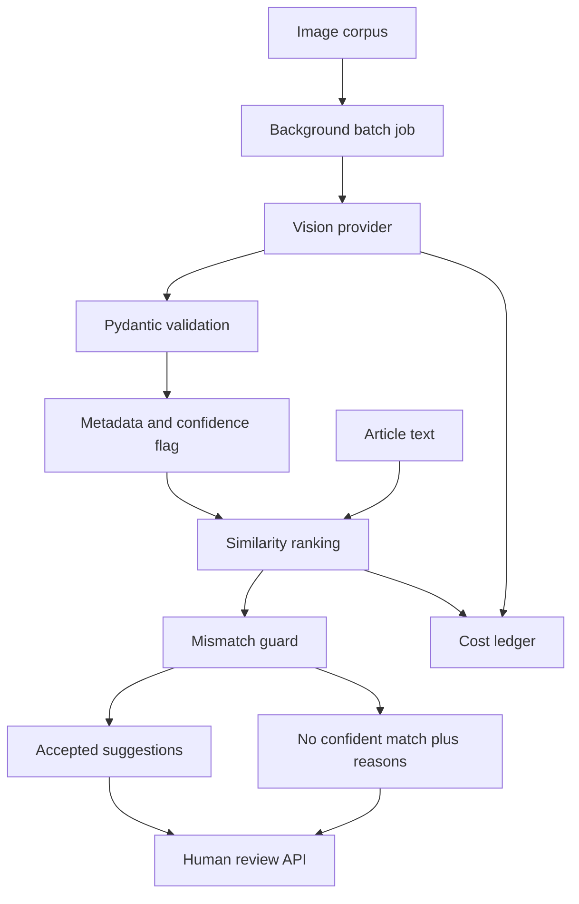

# Architecture

```mermaid
flowchart TD
 A[Image corpus] --> B[Background batch job] --> C[Vision provider] --> D[Pydantic validation] --> E[Metadata and confidence flag]
 G[Article text] --> I[Similarity ranking]
 E --> I
 I --> J[Mismatch guard]
 J --> K[Accepted suggestions]
 J --> L[No confident match plus reasons]
 K --> M[Human review API]
 L --> M
 C --> N[Cost ledger]
 I --> N
```
